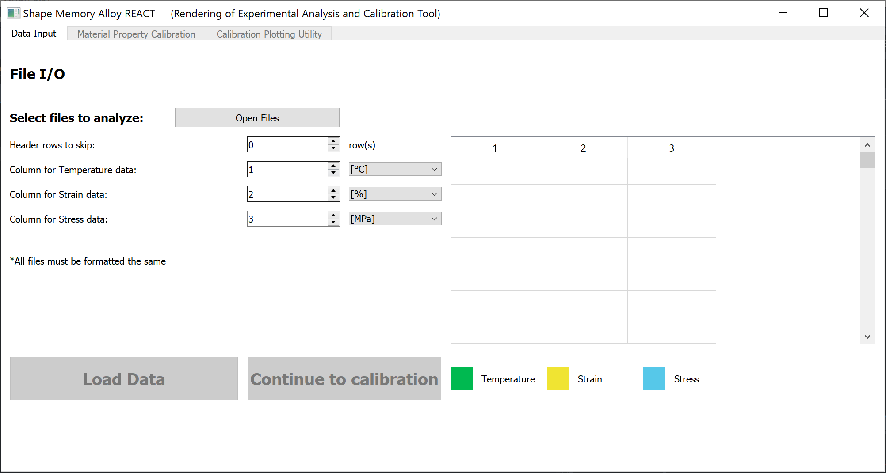
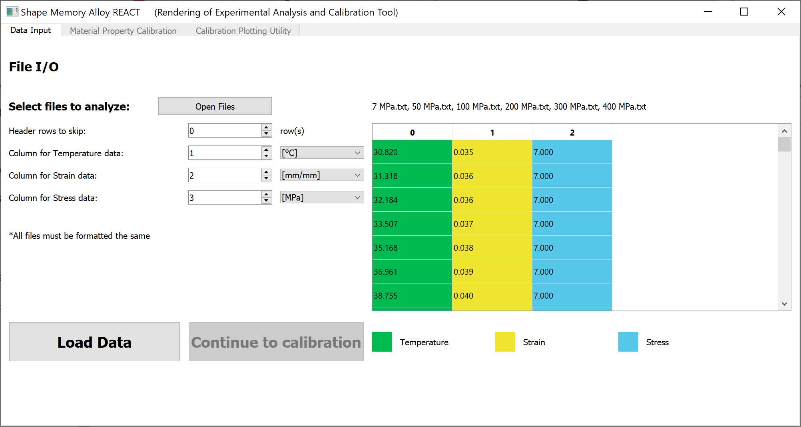
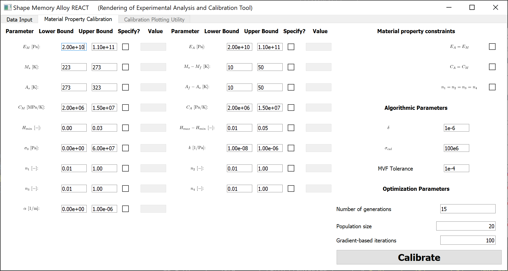
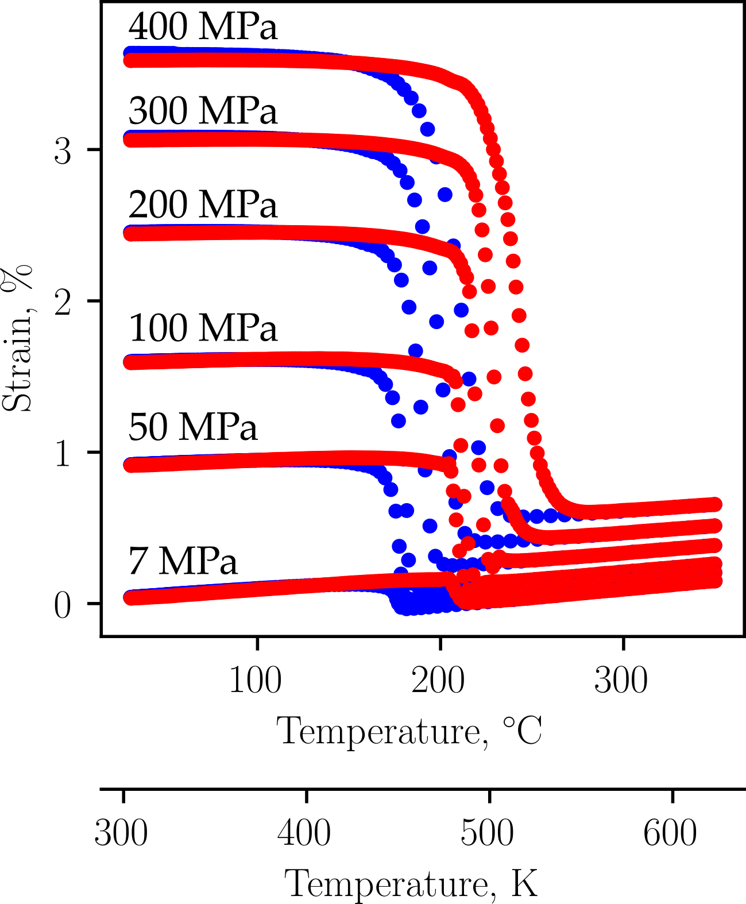
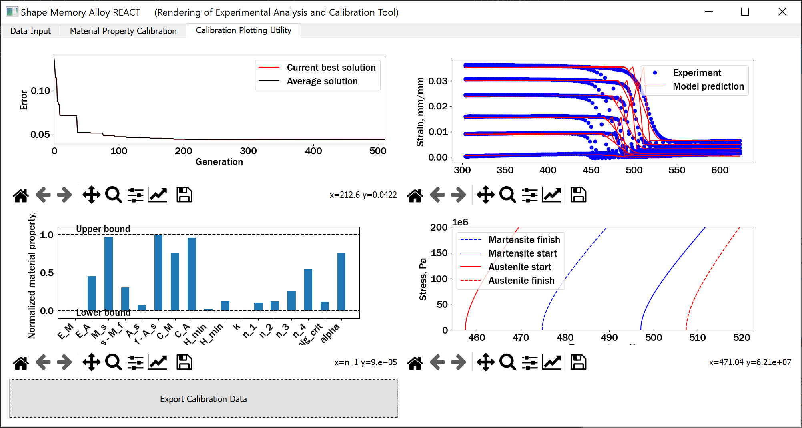
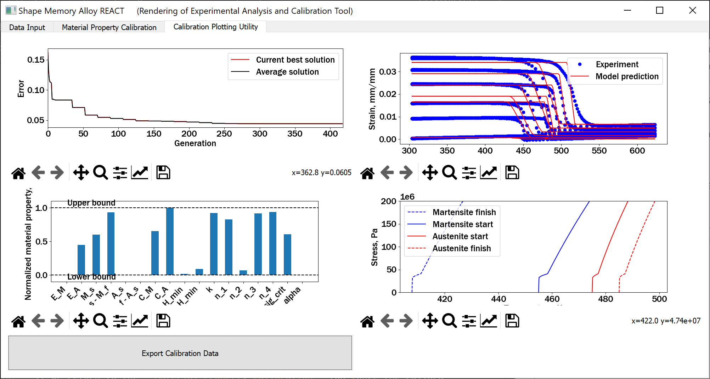
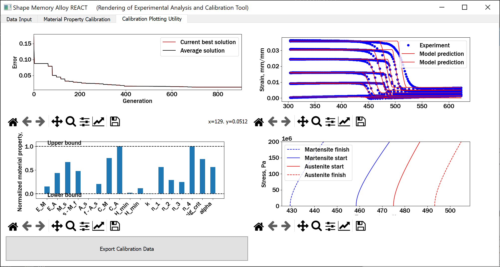

.. SMA-REACT documentation example calibration file

Learning by doing: an example calibration
==========================================

In this tutorial, you will learn how to calibrate
an SMA constitutive model to best fit experimental data.
A full explanation is provided in the reference paper (see :doc:`citation_information`), but here we will focus on the actual implementation
of the tool. 

Open and launch SMA-REACT
-------------------------

In your Python IDE of choice (Spyder is recommended, but the tool has been tested in VS Code), using the correct environment 
(see :doc:`getting_started`), open ``launch_calibration_GUI.py``. Run the file
to activate the GUI. You will be greeted by the data input screen.

Load experimental data
----------------------

For this example, we will use experimental data from Bigelow et al.
(link_, :cite:p:`bigelow_development_2022`). It is distributed with the SMA-REACT package. 
Click ``Open Files``, then navigate to ``SMAREACT/input/cal_sample_2``, and select all experimental text files.
SMA-REACT currently only accepts tab-delimited text files via the ``pandas.read_csv()`` function.

The data records strain in %, so change the dropdown
menu accordingly. You should see the loaded text files displayed by 
file names, and the columns should be colored according to their field. 

.. _link: https://www-sciencedirect-com.wrs.idm.oclc.org/science/article/pii/S2589152921002994

Click ``Load data`` and the ``Continue to calibration`` button will activate. 
If you are satisfied with your data input and unit selection, advance to the 
next stage by clicking ``Continue to calibration``.

Setting design variables and bounds
-----------------------------------

The material property calibration tab shows model and optimization parameters to define a calibration routine.
For this tutorial, we will change the default model parameter bounds 
to better match the experimental data. 
One can also specify certain model parameters by clicking the corresponding toggle button in the ``Specify?`` column and inputting the desired value, 
but we will not do that here. 

Based on the experimental data, the zero-stress Martensite start and finish temperatures appear to be
between 400 K and 500 K, with the Austenite start and finish temperatures being approximately 50 K higher. 
We can change the bounds for the corresponding parameters (:math:`A_f` and :math:`A_s`); 
:math:`A_f - A_s` and :math:`M_s - M_f` need not be changed at this stage. 

Change the lower and upper bounds of Martensite and Austenite start temperatures. 
To get familiar with the interface, play with activating single parameter constraints
(i.e., the ``Specify?`` toggle buttons) and the Material property constraints (shown on the upper right).

We will leave the algorithmic and optimization parameters at their default values. 
Here is a table that explains these parameters:

========================== ==========
Parameter                  Meaning    
========================== ==========  
:math:`\delta`             Algorithmic smoothing for smooth hardening to prevent numerical singularities (see :cite:p:`lagoudas_constitutive_2012`).
:math:`\sigma_{cal}`       Calibration stress; choose a value close to the SMA design working stress.  
MVF Tolerance              Algorithmic tolerance for the convex cutting plane integration routine within the model (see :cite:p:`lagoudas_constitutive_2012`).   
Number of generations      Number of generations for the genetic algorithm (GA). Increase if your GA solution is improving but not converged before exiting.  
Population size            Number of individuals per generation for the GA. Increase if the GA solution is not improving consistently.
Gradient-based iterations  Number of iterations in the gradient-based optimization. Increase if the solution is improving but not converged before exiting.
========================== ==========   

When you are satisfied with your bounds, specified parameters, and algorithmic and optimization parameters, we can calibrate.

Calibrating the Lagoudas constitutive model
-------------------------------------------

Click the ``Calibrate`` button in the lower-right corner of the screen.
This will initiate a calibration routine and automatically open the calibration progress tab.
The calibration progress tab contains four dynamically updated plots (numbered clockwise, starting in the upper left):

   1. The optimization history, which shows the calibration error as a function of generation/gradient-based iteration.
   2. The strain-temperature history of the model (red) vs. experiment (blue) for the current best solution.
   3. The stress-temperature phase diagram for the current best model solution.
   4. Normalized values for all model parameters (i.e., optimization design variables).

Each plot provides essential information for debugging and improving the calibration solution, as we will show here. 

The calibration converged to a solution with under 5% error, but got stuck in a local minima with respect to the transformation temperatures.
The jagged behavior on the strain-temperature plot depicts the fact that the model is converging to extremely different material states at each increment.
This is caused by the Austenite start temperature converging to a value lower the Martensite finish temperature.
Furthermore, the Martensite start temperature and Austenite start temperature converged to approximately the upper and lower bounds, respectively. 
These three pieces of information indicate that the bounds were not tight enough around the expected transformation temperatures. 
If your calibration did not replicate this same behavior, that is fine; there is a degree of randomness in the genetic algorithm formulation. 

If we return to the ``Material Property Calibration`` tab (once the calibration is finished) and tighten the bounds on Martensite start and Austenite start to [425,475] and [475, 525], respectively, 
we get a calibrated solution with again, an error under 5%, but now the transformation strain properties are not correctly predicted.

As the low-stress experiments are not well-predicted, we can constrain :math:`\sigma_{crit}` to be smaller, as well as decreasing the lower bound on :math:`E^M`.
Now, we have a calibration that closely matches the elastic regimes and the low-stress transformation temperatures.
Of course, we can improve by inspecting the normalized material properties and relaxing the bounds for the design variables that 
are converging to the bounds, but that is an exercise left to you. Happy calibrating!
When you are happy with your calibration, you can export a JSON with all of the relevant information by clicking the ``Export Calibration Data`` button. 

